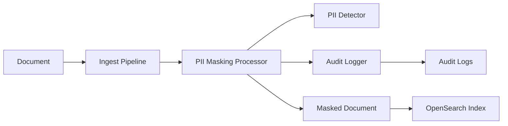

# PII Masking Plugin for OpenSearch


A powerful OpenSearch plugin that automatically detects and masks Personally Identifiable Information (PII) in documents during indexing. Protect sensitive data with zero application changes required.

## 🔐 Overview

The PII Masking Plugin provides **real-time PII protection** at the OpenSearch level, ensuring sensitive data like emails, Social Security Numbers, credit cards, and phone numbers are automatically masked before being stored in your cluster.

### Key Benefits
- 🛡️ **Automatic Protection** - No application code changes required
- ⚡ **Real-time Processing** - PII is masked during document ingestion 
- 📜 **Compliance Ready** - Built-in audit logging for regulatory requirements
- ⚙️ **Configurable** - Customize patterns and masking rules per organization
- 🚫 **Optional Blocking** - Strict mode can reject documents containing PII

## ✨ Features

| Feature | Description | Status |
|---------|-------------|--------|
| 🔍 **PII Detection** | Regex-based detection for emails, SSNs, credit cards, phone numbers | ✅ |
| ✂️ **Smart Masking** | Configurable masking patterns (e.g., `john@example.com` → `****@example.com`) | ✅ |
| 📝 **Audit Logging** | Complete audit trail of all masking operations | ✅ |
| ⚙️ **Field-level Control** | Configure which document fields to scan | ✅ |
| 🚫 **Strict Mode** | Block document indexing if PII detected (optional) | ✅ |
| 🔧 **Zero Configuration** | Works out-of-the-box with sensible defaults | ✅ |

## 🚀 Quick Start

### Prerequisites
- OpenSearch 3.x
- Java 21 or higher

### Installation

#### Traditional Plugin Installation

The PII Masking Plugin follows OpenSearch's standard plugin installation process using the `opensearch-plugin` command-line tool.

1. **Build the plugin ZIP:**
   ```bash
   ./gradlew build
   ```
   This creates a complete plugin package at: `build/distributions/pii-masking.zip`

2. **Install using opensearch-plugin command:**
   ```bash
   ./bin/opensearch-plugin install file:///absolute/path/to/pii-masking-plugin/build/distributions/pii-masking.zip
   ```
   
   **Note:** Use the absolute file path to the ZIP file. The `opensearch-plugin install` command:
   - Validates the plugin structure and compatibility
   - Extracts the plugin to OpenSearch's plugins directory
   - Registers the plugin with OpenSearch's plugin management system

3. **Restart OpenSearch cluster**
   ```bash
   ./bin/opensearch
   ```

4. **Verify installation:**
   ```bash
   curl -X GET "localhost:9200/_cat/plugins?v"
   ```
   Expected output:
   ```
   name         component   version
   node-1       pii-masking unspecified
   ```

#### How the Build System Handles Plugin Packaging

The plugin uses OpenSearch's Gradle plugin system for automated packaging:

```gradle
apply plugin: 'opensearch.opensearchplugin'  // Core plugin functionality
apply plugin: 'opensearch.pluginzip'         // Creates installable ZIP package
```

**Automated Build Process:**
1. **Compilation**: Java source code compiled to bytecode
2. **Dependency Resolution**: All required libraries bundled
3. **Metadata Generation**: `plugin-descriptor.properties` auto-generated with:
   - Plugin name, version, and description
   - Main class entry point (`org.opensearch.plugin.piimasking.PIIMaskingPlugin`)
   - OpenSearch and Java version compatibility
4. **ZIP Creation**: Complete plugin package created in `build/distributions/`

**What's Included in the ZIP:**
- Compiled JAR files with all plugin classes
- Auto-generated `plugin-descriptor.properties` (OpenSearch's plugin manifest)
- License files (`LICENSE.txt`, `NOTICE.txt`)
- All dependencies required for plugin operation

This automated approach ensures the plugin ZIP is always compatible with OpenSearch's plugin installation requirements without manual configuration files.

### Basic Usage

1. **Create an ingest pipeline:**
   ```bash
   curl -X PUT "localhost:9200/_ingest/pipeline/pii-pipeline" \
   -H 'Content-Type: application/json' \
   -d '{
     "description": "Pipeline that masks PII in documents",
     "processors": [
       {
         "pii-masking": {}
       }
     ]
   }'
   ```

2. **Index a document with PII:**
   ```bash
   curl -X POST "localhost:9200/logs/_doc?pipeline=pii-pipeline" \
   -H 'Content-Type: application/json' \
   -d '{
     "message": "User john.doe@example.com logged in with SSN 123-45-6789",
     "user": {
       "email": "admin@company.com"
     }
   }'
   ```

3. **View the masked result:**
   ```bash
   curl -X GET "localhost:9200/logs/_search?pretty"
   ```

   **Result - PII Automatically Masked:**
   ```json
   {
     "_source": {
       "message": "User ****@example.com logged in with SSN ***-**-****",
       "user": {
         "email": "****@example.com"
       }
     }
   }
   ```

## 📋 Supported PII Types

| PII Type | Pattern | Default Mask | Example |
|----------|---------|--------------|---------|
| **Email** | `[a-zA-Z0-9._%+-]+@[a-zA-Z0-9.-]+\.[a-zA-Z]{2,}` | `****@example.com` | `john@company.com` → `****@example.com` |
| **SSN** | `\b\d{3}-\d{2}-\d{4}\b` | `***-**-****` | `123-45-6789` → `***-**-****` |
| **Credit Card** | `\b(?:\d[ -]*?){13,16}\b` | `****-****-****-****` | `4532 1234 5678 9012` → `****-****-****-****` |
| **Phone** | `\b\d{3}-\d{3}-\d{4}\b` | `***-***-****` | `555-123-4567` → `***-***-****` |

### Default Monitored Fields
The plugin scans these document fields by default:
- `message`
- `user.email`  
- `details`

## ⚙️ Configuration

### Global Configuration (Default)
```json
{
  "enabled": true,
  "auditIndex": "pii-audit-log",
  "strictMode": false,
  "fieldsToCheck": ["message", "user.email", "details"],
  "maskingRules": {
    "email": {
      "pattern": "[a-zA-Z0-9._%+-]+@[a-zA-Z0-9.-]+\\.[a-zA-Z]{2,}",
      "mask": "****@example.com"
    },
    "ssn": {
      "pattern": "\\b\\d{3}-\\d{2}-\\d{4}\\b", 
      "mask": "***-**-****"
    }
  }
}
```

### Strict Mode
Enable strict mode to **block documents** containing unmasked PII:

```json
{
  "processors": [
    {
      "pii-masking": {
        "strict_mode": true
      }
    }
  ]
}
```

When strict mode is enabled and PII is detected, indexing will fail with:
```json
{
  "error": "Document contains PII and strict mode is enabled. Document blocked."
}
```

## 🧪 Testing

### Run All Tests
```bash
./gradlew check
```

### Integration Tests
```bash
./gradlew integTest
```

### Manual Testing
Start OpenSearch with the plugin:
```bash
./gradlew run
```

Then test using the examples in the [DEMO_GUIDE.md](DEMO_GUIDE.md).

## 📊 Monitoring & Audit Logging

All PII masking activities are automatically logged to OpenSearch logs with detailed information:

```
[2025-08-25T18:31:40.808Z] PII masked - Index: logs, DocId: abc123, Field: message, 
Type: email, Original: john@example.com, Masked: ****@example.com

[2025-08-25T18:31:40.809Z] PII masked - Index: logs, DocId: abc123, Field: message, 
Type: ssn, Original: 123-45-6789, Masked: ***-**-****
```

### Audit Log Format
- **Timestamp**: ISO 8601 format
- **Action**: `masked` or `blocked`
- **Index**: Target index name
- **Document ID**: Document identifier
- **Field**: Document field containing PII
- **PII Type**: Type of PII detected (`email`, `ssn`, `credit_card`, `phone`)
- **Original**: Original PII value (for audit purposes)
- **Masked**: Replacement value used

## 🏗️ Architecture



### Core Components

- **PIIMaskingPlugin**: Main plugin class and OpenSearch integration
- **PIIMaskingProcessor**: Ingest processor that handles document processing
- **PIIDetector**: Regex-based PII detection and masking engine
- **AuditLogger**: Compliance logging for all masking operations
- **PIIConfiguration**: Configurable rules and patterns

### Processing Flow

1. **Document Ingestion**: Document arrives via index API or bulk API
2. **Pipeline Processing**: Ingest pipeline routes document to PII processor
3. **Field Scanning**: Processor scans configured fields for PII patterns
4. **PII Detection**: Regex patterns identify sensitive information
5. **Masking**: Detected PII replaced with configured mask values
6. **Audit Logging**: All operations logged for compliance
7. **Indexing**: Masked document stored in OpenSearch

## 🔧 Development

### Building from Source
```bash
git clone https://github.com/gaurav2612gupta/pii-masking-plugin.git
cd pii-masking-plugin
./gradlew build
```

### Project Structure
```
src/
├── main/java/org/opensearch/plugin/piimasking/
│   ├── PIIMaskingPlugin.java           # Main plugin class
│   ├── processor/
│   │   └── PIIMaskingProcessor.java     # Ingest processor implementation
│   ├── detector/
│   │   └── PIIDetector.java             # PII detection engine
│   ├── audit/
│   │   └── AuditLogger.java             # Audit logging
│   └── config/
│       └── PIIConfiguration.java       # Configuration management
└── test/
    └── java/org/opensearch/plugin/piimasking/
        ├── PIIMaskingTests.java         # Unit tests
        └── PIIMaskingPluginIT.java      # Integration tests
```

## 🤝 Contributing

We welcome contributions! Please see our [Contributing Guide](CONTRIBUTING.md) for details.

### Development Workflow
1. Fork the repository
2. Create a feature branch
3. Add tests for new functionality
4. Ensure all tests pass: `./gradlew check`
5. Submit a pull request

### Reporting Issues
- Use GitHub Issues for bug reports and feature requests
- Include OpenSearch version, plugin version, and reproduction steps
- For security issues, please follow responsible disclosure practices

## 📜 License

This project is licensed under the Apache License 2.0 - see the [LICENSE.txt](LICENSE.txt) file for details.


## 📞 Support

- **Documentation**: [DEMO_GUIDE.md](DEMO_GUIDE.md) for detailed examples
- **Issues**: [GitHub Issues](https://github.com/gaurav2612gupta/pii-masking-plugin/issues)

---

**Protect your data automatically with the PII Masking Plugin! 🛡️**
